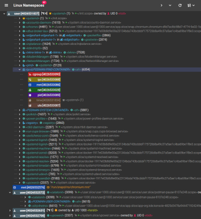
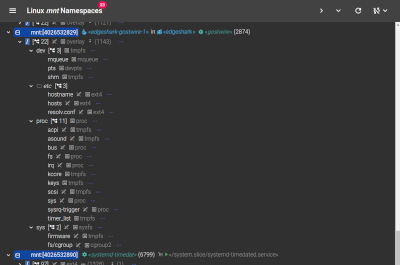

# Linux kernel Namespaces

[](https://thediveo.github.io/lxkns)
[](https://pkg.go.dev/github.com/thediveo/lxkns)
[](https://img.shields.io/github/license/thediveo/lxkns)


[](https://goreportcard.com/report/github.com/thediveo/lxkns)

Discover how containers are using Linux kernel namespaces...

[](docs/_images/all-namespaces-with-containers.png)

...or the mounts inside your containers, and how _over-mounts_ make other mounts
_invisible_.

[](docs/_images/container-mounts.png)

## Quick Start

First, ensure that you have the Docker compose v2 plugin installed.

> Debian users typically need to install docker-ce instead of docker.io
> packages, as Debian only backports random "security fixes" and freezes
> features completely – which absolutely makes sense in a fast moving container
> world ... _NOT_.

Then on either an amd64 or arm64 architecture issue the following CLI command:

```bash
wget -q --no-cache -O - \
  https://github.com/thediveo/lxkns/raw/master/deployments/wget/docker-compose.yaml \
  | docker compose -f - up
```

Finally, visit `http://localhost:5010` and start looking around Linux kernel
namespaces, as well as mount points with their hierarchies.

## Overview

`lxkns` discovers...
- **Linux namespaces** in almost every nook and cranny of your hosts (from open
  file descriptors, bind-mounts, processes, and now even tasks and from open
  sockets) – please see the table below,
- the **mount points inside mount namespaces** (correctly representing
  "overmounts").
- **container workloads**: these are automatically related to the underlying
  Linux namespaces.
  - `lxkns` now leverages [(Siemens OSS) Turtlefinder
    technology](https://github.com/siemens/turtlefinder) to autodetect container
    engines even in hierarchical configurations, such as Kubernetes-in-Docker
    and Docker Desktop on WSL2. Also, (socket-activated) podman detection has
    finally landed in turtlefinder, and in turn also in `lxkns`.


| | Where? | `lsns` | `lxkns` |
| --- | --- | :---: | :---: |
| ①  | `/proc/*/ns/*` | ✓ | ✓ |
| ②  | `/proc/*/task/*/ns/*` | ✗ | ✓ |
| ③  | bind mounts | ✗ | ✓ |
| ➃a | `/proc/*/fd/*` namespace fds | ✗ | ✓ |
| ➃b | `/proc/*/fd/*` socket fds | ✗ | ✓ |
| ➄  | namespace hierarchy | ✗ | ✓ |
| ➅  | owning user namespaces | ✗ | ✓ |

For mount namespaces, lxkns finds mount points even in process-less mount
namespaces (for instance, as utilized in ["snap"
technology](https://snapcraft.io/docs)). Our discovery engine even determines
the visibility of mount points, taking different forms of "overmounting" into
consideration.

Take a look at the comprehensive [user (and developer)
manual](https://thediveo.github.io/lxkns).

> Please check [Important Changes](https://thediveo.github.io/lxkns#/changelog),
> especially if you have been used the API in the past, and not only the
> service.

## Intro Video

Or, watch the short overview video how to find your way around discovery web
frontend:

[](https://www.youtube.com/watch?v=4e6_jGLM9JA)

## Detected/Supported Container Engines

The following container engine types are supported:
- [Docker](https://docker.com),
- plain [containerd](https://containerd.io/),
- via the [CRI Evented
  PLEG API](https://github.com/kubernetes/enhancements/blob/master/keps/sig-node/3386-kubelet-evented-pleg/README.md):
  [containerd](https://containerd.io/) and [CRI-O](https://cri-o.io/),
- [socket-activatable](https://github.com/containers/podman/blob/main/docs/tutorials/socket_activation.md)
  [podman](https://podman.io/) – via the Docker-compatible API only. Please note
  that there is no support for podman-proprietary pods (not to be confused with
  Kubernetes pods).

## Deployment Options

The `lxkns` discovery engine can be operated as a stand-alone REST service with
additional web UI. Alternatively, it can be embedded/integrated into other
system diagnosis tools. A prominent example of embedding `lxkns` is
[@siemens/ghostwire](https://github.com/siemens/ghostwire).

## Notes

### Supported Go Versions

`lxkns` supports versions of Go that are noted by the [Go release
policy](https://golang.org/doc/devel/release.html#policy), that is, major
versions _N_ and _N_-1 (where _N_ is the current major version).

## Hacking It

This project comes with comprehensive unit tests, also covering leak checks:

* goroutine leak checking courtesy of Gomega's
  [`gleak`](https://onsi.github.io/gomega/#codegleakcode-finding-leaked-goroutines)
  package.

* file descriptor leak checking courtesy of the
  [@thediveo/fdooze](https://github.com/thediveo/fdooze) module.

> **Note:** do **not run parallel tests** for multiple packages. `make test`
ensures to run all package tests always sequentially, but in case you run `go
test` yourself, please don't forget `-p 1` when testing multiple packages in
one, _erm_, go.

## Contributing

Please see [CONTRIBUTING.md](CONTRIBUTING.md).

## Copyright and License

`lxkns` is Copyright 2020‒23 Harald Albrecht, and licensed under the Apache
License, Version 2.0.
