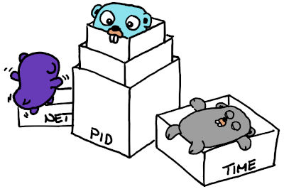

# Linux kernel Namespaces

…and Containers.

`lxkns` is a Golang package for discovering Linux kernel namespaces as well as
mount points in mount namespaces. It then relates them to containers, where
possible. In every nook and cranny of your Linux hosts.

Discovery can be operated as a stand-alone REST service (both web UI and JSON
discovery results) or integrated into system diagnosis tools that need an
unobstructed view on Linux-kernel namespaces.

For mount namespaces, lxkns finds mount points even in process-less mount
namespaces (for instance, as utilized in ["snap"
technology](https://snapcraft.io/docs)). Our discovery engine even determines
the visibility of mount points, taking different forms of "overmounting" into
consideration.

Take a look at the comprehensive [user (and developer)
manual](https://thediveo.github.io/lxkns).

Or, watch the short overview video how to find your way around discovery web
frontend:

## ⚖️ Copyright and License

`lxkns` is Copyright 2020‒21 Harald Albrecht, and licensed under the Apache
License, Version 2.0.
