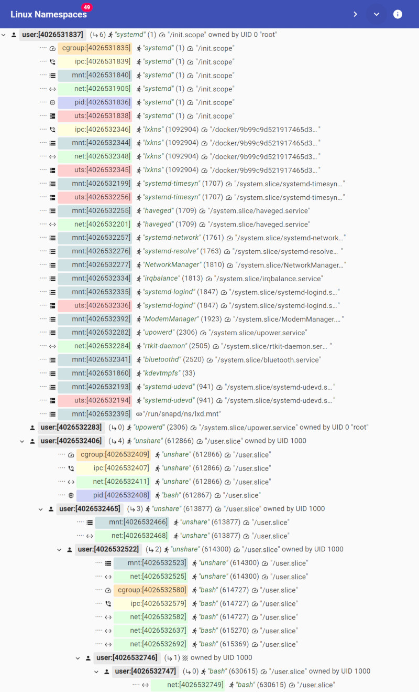

# Linux kernel Namespaces 

[](https://pkg.go.dev/github.com/thediveo/lxkns)
[](docs/architecture.md)
[](https://img.shields.io/github/license/thediveo/lxkns)

[](https://goreportcard.com/report/github.com/thediveo/lxkns)

`lxkns` is a Golang package for discovering Linux kernel namespaces. In every
nook and cranny of your Linux hosts. This package also features marshalling and
unmarshalling namespace discovery results to and from JSON – which is especially
useful to separate the super-privileged scanner from non-root frontends: run
namespace discoveries as a containerized service.

In addition, `lxkns` comes with a set of unique CLI namespace discovery tools
and also helps Go programs with switching namespaces.

And all that tested with Go 1.13-1.15. And even with support for the new time
namespaces.

## 🔎 Comprehensive Namespace Discovery

When compared to most well-known and openly available CLI tools, such as
`lsns`, the `lxkns` package detects namespaces even in places of a running
Linux system other tools typically do not consider. In particular:

1. from the procfs filesystem in `/proc/[PID]/ns/*` – as `lsns` and other
   tools do.
2. bind-mounted namespaces, via `/proc/[PID]/mountinfo`. Our discovery method
   even finds bind-mounted namespaces in _other_ mount namespaces than the
   current one in which the discovery starts.
3. file descriptor-referenced namespaces, via `/proc/[PID]/fd/*`.
4. intermediate hierarchical user and PID namespaces, via `NS_GET_PARENT`
   ([man 2 ioctl_ns](http://man7.org/linux/man-pages/man2/ioctl_ns.2.html)).
5. user namespaces owning non-user namespaces, via `NS_GET_USERNS` ([man 2
   ioctl_ns](http://man7.org/linux/man-pages/man2/ioctl_ns.2.html)).

| tool | `/proc/[PID]/ns/*` ① | bind mounts ② | `/proc/[PID]/fd/*` ③ | hierarchy ④ | owning user namespaces ⑤ |
| --- | --- | --- | --- | --- | --- |
| `lsns` | ✓ | | | |
| `lxkns` | ✓ | ✓ | ✓ | ✓ | ✓ |

Applications can control the extent to which a `lxkns` discovery tries to
ferret out namespaces from the nooks and crannies of Linux hosts.

> Some discovery methods are more expensive than others, especially the
> discovery of bind-mounted namespaces in other mount namespaces. The reason
> lies in the design of the Go runtime which runs multiple threads and Linux
> not allowing multi-threaded processes to switch mount namespaces. In order
> to work around this constraint, `lxkns` must fork and immediately re-execute
> the process it is used in. Applications that want to use such advanced
> discovery methods thus **must** call `reexec.CheckAction()` as early as
> possible in their `main()` function. For this, you need to `import
> "github.com/thediveo/gons/reexec"`.

In addition, lxkns also discovers some control group information for the
processes attached to namespaces. In particular, the discovery will relate
processes to the control groups created for the "cpu" v1 controller type. To a
limited extend, the names of these control groups will relate to the
partitioning of processes using Linux kernel namespaces. For instance, processes
in Docker containers will show control group names in the form of `docker/<id>`,
where the id is the usual 64 hex char string. Plain containerd container
processes will show up with `<namespace>/<id>` control group names.

## 🧰 lxkns Tools

But `lxkns` is more than "just" a Golang package. It also features...

- **lxkns discovery service** exposing namespace discovery information via a
  simple REST API. Of course, our service is build with, guess, `lxkns`.
- **CLI tools** also build on top of `lxkns` (we _do_ eat our own dog food).

### 🐋 lxkns REST Service

To give the containerized lxkns discovery service a test drive (needs Docker
with docker-compose to be installed) you can play around with our "Linux
namespaces" react app:

1. `make deploy`,
2. and then navigate to http://localhost:5010. The lxkns web app should load
   automatically and then display the discovery results. The app bar controls
   show tooltips when hovering over them.
   - `>` collapses all user namespace nodes, except for the initial user namespace.
   - `v` expands all user namespace nodes.
   - `⟳` manuals refresh -- whenevery you want; displays a progress indicator in
     case of slow refreshes.
   - `🔄` opens a pop-up menu to change the refresh interval or switch off
     automatic refresh. Your refresh setting will be stored in your browser's
     local storage.
   - `🛈` shows some app blurb.

   

Some deployment notes about the lxkns service container:

- **read-only:** the lxkns service can be used on a read-only container filesystem.
- **non-root:** the holy grail of container hardening ... wait till you get to
  see our capabilities 😏
- **unprivileged:** because that doesn't mean in-capable 😈
- **capabilities:** not much to see here, just `CAP_SYS_ADMIN`,
  `CAP_SYS_CHROOT`, `CAP_SYS_PTRACE`, and `CAP_DAC_READ_SEARCH`.

### 🖥️ CLI Tools

To build and install all CLI tools:
- *system install:* simply run `make install` to install the tools into your
   system, defaults to `/usr/local/bin`.
- *local install:* `go install ./cmd/... ./examples/lsallns` installs only
   into `$GOPATH/bin`.

The tools:

- `lsuns`
  [](http://godoc.org/github.com/thediveo/lxkns/cmd/lsuns):
  shows _all_ user namespaces in your Linux host, in a neat hierarchy.
  Moreover, it can also show the non-user namespaces "owned" by user
  namespaces. This ownership information is important with respect to
  capabilities and processes switching namespaces using `setns()` ([man 2
  setns](http://man7.org/linux/man-pages/man2/setns.2.html)).

- `lspidns`
  [](http://godoc.org/github.com/thediveo/lxkns/cmd/lspidns):
  shows _all_ PID namespaces in your Linux host, in a neat hierarchy.
  Optionally, the owning user namespaces can be shown interleaved with the PID
  namespace hierarchy.

- `pidtree`
  [](http://godoc.org/github.com/thediveo/lxkns/cmd/pidtree):
  shows either the process hierarchy within the PID namespace hierarchy or a
  single branch only.

- `nscaps`
  [](http://godoc.org/github.com/thediveo/lxkns/cmd/nscaps):
  determines a process' capabilities in a namespace, and then displays the
  owning user namespace hierarchy (or hierarchies) of the process and target
  namespace, together with the current process and namespace capabilities.

- `dumpns`
  [](http://godoc.org/github.com/thediveo/lxkns/cmd/dumpns):
  runs a namespace (and process) discovery and then dumps the results as JSON.


### lsuns

In its simplest form, `lsuns` shows the hierarchy of user namespaces.

```
$ sudo lsuns
user:[4026531837] process "systemd" (1) created by UID 0 ("root")
├─ user:[4026532454] process "unshare" (98171) controlled by "user.slice" created by UID 1000 ("harald")
└─ user:[4026532517] process "upowerd" (96159) controlled by "system.slice/upower.service" created by UID 0 ("root")
```

> **Note:** `lsuns` does not only show the user namespaces with their IDs and
> hierarchy. It also shows the "most senior" process attached to the particular
> user namespace, as well as the user "owning" the user namespace. The "most
> senior" process is the top-most process in the process tree still attached to
> a (user) namespace; in case of multiple top-most processes – such as init(1)
> and kthreadd(2) – the older process will be choosen (or the one if the lowest
> PID as in case of the same-age init and kthreadd).

The control group name ("controlled by ...") is the name of the v1 "cpu" control
sub-group controlling a particular most senior process. This name is relative to
the root of the control group filesystem (such as `/sys/fs/cgroup`). The root is
left out in order to reduce clutter.

#### Showing Owned (Non-User) Namespaces

It gets more interesting with the `-d` (details) flag: `lsuns` then additionally
displays all non-user namespaces owned by the user namespaces. In Linux-kernel
namespace parlance, "owning" refers to the relationship between a newly created
namespace and the user namespace that was active at the time the new namespace
was created. For convenience, `lsuns` sorts the owned namespaces first
alphabetically by type, and second numerically by namespace IDs.

```
$ sudo lsuns -d
user:[4026531837] process "systemd" (1) created by UID 0 ("root")
│  ⋄─ cgroup:[4026531835] process "systemd" (1)
│  ⋄─ ipc:[4026531839] process "systemd" (1)
│  ⋄─ ipc:[4026532332] process "systemd" (5492) controlled by "docker/c8bf69d0651425244f472e89677177e3d488274f1d242c62a50a82f35feb8c4a"
│  ⋄─ ipc:[4026532397] process "sleep" (6025) controlled by "docker/c8bf69d0651425244f472e89677177e3d488274f1d242c62a50a82f35feb8c4a/default/sleepy"
│  ⋄─ mnt:[4026531840] process "systemd" (1)
│  ⋄─ mnt:[4026531860] process "kdevtmpfs" (33)
│  ⋄─ mnt:[4026532184] process "systemd-udevd" (946) controlled by "system.slice/systemd-udevd.service"
│  ⋄─ mnt:[4026532245] process "haveged" (1688) controlled by "system.slice/haveged.service"
│  ⋄─ mnt:[4026532246] process "systemd-timesyn" (1689) controlled by "system.slice/systemd-timesyncd.service"
│  ⋄─ mnt:[4026532248] process "systemd-network" (1709) controlled by "system.slice/systemd-networkd.service"
│  ⋄─ mnt:[4026532267] process "systemd-resolve" (1711) controlled by "system.slice/systemd-resolved.service"
│  ⋄─ mnt:[4026532268] process "NetworkManager" (1757) controlled by "system.slice/NetworkManager.service"
│  ⋄─ mnt:[4026532269] bind-mounted at "/run/snapd/ns/lxd.mnt"
│  ⋄─ mnt:[4026532325] process "irqbalance" (1761) controlled by "system.slice/irqbalance.service"
│  ⋄─ mnt:[4026532326] process "systemd-logind" (1779) controlled by "system.slice/systemd-logind.service"
│  ⋄─ mnt:[4026532327] process "ModemManager" (1840) controlled by "system.slice/ModemManager.service"
│  ⋄─ mnt:[4026532330] process "systemd" (5492) controlled by "docker/c8bf69d0651425244f472e89677177e3d488274f1d242c62a50a82f35feb8c4a"
│  ⋄─ mnt:[4026532388] process "bluetoothd" (2239) controlled by "system.slice/bluetooth.service"
│  ⋄─ mnt:[4026532395] process "sleep" (6025) controlled by "docker/c8bf69d0651425244f472e89677177e3d488274f1d242c62a50a82f35feb8c4a/default/sleepy"
│  ⋄─ mnt:[4026532513] process "colord" (83614) controlled by "system.slice/colord.service"
│  ⋄─ mnt:[4026532516] process "upowerd" (96159) controlled by "system.slice/upower.service"
│  ⋄─ net:[4026531905] process "systemd" (1)
│  ⋄─ net:[4026532191] process "haveged" (1688) controlled by "system.slice/haveged.service"
│  ⋄─ net:[4026532274] process "rtkit-daemon" (2211) controlled by "system.slice/rtkit-daemon.service"
│  ⋄─ net:[4026532335] process "systemd" (5492) controlled by "docker/c8bf69d0651425244f472e89677177e3d488274f1d242c62a50a82f35feb8c4a"
│  ⋄─ net:[4026532400] process "sleep" (6025) controlled by "docker/c8bf69d0651425244f472e89677177e3d488274f1d242c62a50a82f35feb8c4a/default/sleepy"
│  ⋄─ pid:[4026531836] process "systemd" (1)
│  ⋄─ pid:[4026532333] process "systemd" (5492) controlled by "docker/c8bf69d0651425244f472e89677177e3d488274f1d242c62a50a82f35feb8c4a"
│  ⋄─ pid:[4026532398] process "sleep" (6025) controlled by "docker/c8bf69d0651425244f472e89677177e3d488274f1d242c62a50a82f35feb8c4a/default/sleepy"
│  ⋄─ uts:[4026531838] process "systemd" (1)
│  ⋄─ uts:[4026532185] process "systemd-udevd" (946) controlled by "system.slice/systemd-udevd.service"
│  ⋄─ uts:[4026532247] process "systemd-timesyn" (1689) controlled by "system.slice/systemd-timesyncd.service"
│  ⋄─ uts:[4026532324] process "systemd-logind" (1779) controlled by "system.slice/systemd-logind.service"
│  ⋄─ uts:[4026532331] process "systemd" (5492) controlled by "docker/c8bf69d0651425244f472e89677177e3d488274f1d242c62a50a82f35feb8c4a"
│  ⋄─ uts:[4026532396] process "sleep" (6025) controlled by "docker/c8bf69d0651425244f472e89677177e3d488274f1d242c62a50a82f35feb8c4a/default/sleepy"
├─ user:[4026532454] process "unshare" (98171) controlled by "user.slice" created by UID 1000 ("harald")
│     ⋄─ mnt:[4026532455] process "unshare" (98171) controlled by "user.slice"
│     ⋄─ mnt:[4026532457] process "unshare" (98172) controlled by "user.slice"
│     ⋄─ pid:[4026532456] process "unshare" (98172) controlled by "user.slice"
│     ⋄─ pid:[4026532458] process "bash" (98173) controlled by "user.slice"
└─ user:[4026532517] process "upowerd" (96159) controlled by "system.slice/upower.service" created by UID 0 ("root")
```

### lspidns

On its surface, `lspidns` might appear to be `lsuns` twin, but now for PID namespaces.

```
pid:[4026531836] process "systemd" (1)
├─ pid:[4026532333] process "systemd" (5492) controlled by "docker/c8bf69d0651425244f472e89677177e3d488274f1d242c62a50a82f35feb8c4a"
│  └─ pid:[4026532398] process "sleep" (6025) controlled by "docker/c8bf69d0651425244f472e89677177e3d488274f1d242c62a50a82f35feb8c4a/default/sleepy"
└─ pid:[4026532456] process "unshare" (99577) controlled by "user.slice"
   └─ pid:[4026532459] process "unshare" (99578) controlled by "user.slice"
      └─ pid:[4026532460] process "bash" (99579) controlled by "user.slice"
```

> **Nota Bene:** if you look closely at the control group names of the PID
> namespace processes, then you might notice that there is an outer Docker
> container with an inner container. This inner container happens to be a
> containerd container in the "default" namespace.

#### User-PID Hierarchy

But hidden beneath the surface lies the `-u` flag; "u" as in user namespace. Now
what have user namespaces to do with PID namespaces? Like other non-user
namespaces, also PID namespaces are *owned* by user namespaces. `-u` now tells
`lspidns` to show a "synthesized" hierarchy where owning user namespaces and
owned PID namespaces are laid out in a single tree.

```
user:[4026531837] process "systemd" (1) created by UID 0 ("root")
└─ pid:[4026531836] process "systemd" (1)
   ├─ pid:[4026532333] process "systemd" (5492) controlled by "docker/c8bf69d0651425244f472e89677177e3d488274f1d242c62a50a82f35feb8c4a"
   │  └─ pid:[4026532398] process "sleep" (6025) controlled by "docker/c8bf69d0651425244f472e89677177e3d488274f1d242c62a50a82f35feb8c4a/default/sleepy"
   └─ user:[4026532454] process "unshare" (99576) controlled by "user.slice" created by UID 1000 ("harald")
      └─ pid:[4026532456] process "unshare" (99577) controlled by "user.slice"
         └─ user:[4026532457] process "unshare" (99577) controlled by "user.slice" created by UID 1000 ("harald")
            └─ pid:[4026532459] process "unshare" (99578) controlled by "user.slice"
               └─ pid:[4026532460] process "bash" (99579) controlled by "user.slice"
```

> **Note:** this tree-like representation is possible because the capabilities
> rules for user and PID namespaces forbid user namespaces criss-crossing PID
> namespaces and vice versa.

### pidtree

`pidtree` shows either the process hierarchy within the PID namespace
hierarchy or a single branch only. It additionally shows translated PIDs,
which are valid only inside the PID namespace processes are joined to. Such as
in `"containerd" (24446=78)`, where the PID namespace-local PID is 78, but
inside the initial (root) PID namespace the PID is 24446 instead.

```
$ sudo pidtree
pid:[4026531836], owned by UID 0 ("root")
├─ "systemd" (1)
│  ├─ "systemd-journal" (910) controlled by "system.slice/systemd-journald.service"
│  ├─ "systemd-udevd" (946) controlled by "system.slice/systemd-udevd.service"
...
│  ├─ "containerd" (1836) controlled by "system.slice/containerd.service"
│  │  └─ "containerd-shim" (5472) controlled by "system.slice/containerd.service"
│  │     └─ pid:[4026532333], owned by UID 0 ("root")
│  │        ├─ "systemd" (5492/1) controlled by "docker/c8bf69d0651425244f472e89677177e3d488274f1d242c62a50a82f35feb8c4a"
│  │        │  ├─ "systemd-journal" (5642/66) controlled by "docker/c8bf69d0651425244f472e89677177e3d488274f1d242c62a50a82f35feb8c4a/system.slice/systemd-journald.service"
│  │        │  ├─ "containerd" (5709/72) controlled by "docker/c8bf69d0651425244f472e89677177e3d488274f1d242c62a50a82f35feb8c4a/system.slice/containerd.service"
│  │        │  ├─ "setup.sh" (5712/73) controlled by "docker/c8bf69d0651425244f472e89677177e3d488274f1d242c62a50a82f35feb8c4a/system.slice/testing.service"
│  │        │  │  └─ "ctr" (5978/107) controlled by "docker/c8bf69d0651425244f472e89677177e3d488274f1d242c62a50a82f35feb8c4a/system.slice/testing.service"
│  │        │  └─ "containerd-shim" (5999/126) controlled by "docker/c8bf69d0651425244f472e89677177e3d488274f1d242c62a50a82f35feb8c4a/system.slice/containerd.service"
│  │        │     └─ pid:[4026532398], owned by UID 0 ("root")
│  │        │        ├─ "sleep" (6025/146/1) controlled by "docker/c8bf69d0651425244f472e89677177e3d488274f1d242c62a50a82f35feb8c4a/default/sleepy"
│  │        │        └─ "sh" (6427/235/7) controlled by "docker/c8bf69d0651425244f472e89677177e3d488274f1d242c62a50a82f35feb8c4a/default/sleepy"
```
  
Alternatively, it can show just a single branch down to a PID inside a
specific PID namespace.

```
$ sudo pidtree -n pid:[4026532398] -p 7
pid:[4026531836], owned by UID 0 ("root")
└─ "systemd" (1)
   └─ "containerd" (1836) controlled by "system.slice/containerd.service"
      └─ "containerd-shim" (5472) controlled by "system.slice/containerd.service"
         └─ pid:[4026532333], owned by UID 0 ("root")
            └─ "systemd" (5492/1) controlled by "docker/c8bf69d0651425244f472e89677177e3d488274f1d242c62a50a82f35feb8c4a"
               └─ "containerd-shim" (5999/126) controlled by "docker/c8bf69d0651425244f472e89677177e3d488274f1d242c62a50a82f35feb8c4a/system.slice/containerd.service"
                  └─ pid:[4026532398], owned by UID 0 ("root")
                     └─ "sh" (6427/235/7) controlled by "docker/c8bf69d0651425244f472e89677177e3d488274f1d242c62a50a82f35feb8c4a/default/sleepy"
```

Please see also the [pidtree
command](https://godoc.org/github.com/thediveo/lxkns/cmd/pidtree)
documentation.

### nscaps

`nscaps` calculates a process capabilities in another namespace, based on the
owning user namespace hierarchy. It then displays both the process' and target
namespace user namespace hierarchy for better visual reference how process and
target namespace relate to each other.

Examples like the one below will give unsuspecting security "experts" a series
of fits -- despite this example being perfectly secure.

```
⛛ user:[4026531837] process "systemd" (129419)
├─ process "nscaps" (210373)
│     ⋄─ (no capabilities)
└─ ✓ user:[4026532342] process "unshare" (176744)
   └─ target net:[4026532353] process "unshare" (176744)
         ⋄─ cap_audit_control    cap_audit_read       cap_audit_write      cap_block_suspend
         ⋄─ cap_chown            cap_dac_override     cap_dac_read_search  cap_fowner
         [...]
         ⋄─ cap_syslog           cap_wake_alarm
```

...it's secure, because our superpower process can't do anything outside its
realm. But the horror on the faces of security experts will be priceless.

```
⛔ user:[4026531837] process "systemd" (211474)
├─ ⛛ user:[4026532468] process "unshare" (219837)
│  └─ process "unshare" (219837)
│        ⋄─ cap_audit_control    cap_audit_read       cap_audit_write      cap_block_suspend
│        ⋄─ cap_chown            cap_dac_override     cap_dac_read_search  cap_fowner
│        ⋄─ cap_fsetid           cap_ipc_lock         cap_ipc_owner        cap_kill
│        ⋄─ cap_lease            cap_linux_immutable  cap_mac_admin        cap_mac_override
│        ⋄─ cap_mknod            cap_net_admin        cap_net_bind_service cap_net_broadcast
│        ⋄─ cap_net_raw          cap_setfcap          cap_setgid           cap_setpcap
│        ⋄─ cap_setuid           cap_sys_admin        cap_sys_boot         cap_sys_chroot
│        ⋄─ cap_sys_module       cap_sys_nice         cap_sys_pacct        cap_sys_ptrace
│        ⋄─ cap_sys_rawio        cap_sys_resource     cap_sys_time         cap_sys_tty_config
│        ⋄─ cap_syslog           cap_wake_alarm
└─ target net:[4026531905] process "systemd" (211474)
      ⋄─ (no capabilities)
```

Please see also the [nscaps
command](https://godoc.org/github.com/thediveo/lxkns/cmd/nscaps)
documentation.

### dumpns

The lxkns namespace discovery information can also be easily made available to
your own scripts, et cetera. Without having to integrate the Go package, simply
run the `dumpns` CLI binary: it dumps fresh discovery results as JSON.

```
$ dumpns
{
  "namespaces": {
    "4026531840": {
      "nsid": 4026531840,
      "type": "mnt",
      "owner": 4026531837,
      "reference": "/proc/2849/ns/mnt",
      "leaders": [
        2849,
        2770,
        2662,
        2847
      ]
    },
    "4026531835": {
      "nsid": 4026531835,
      "type": "cgroup",
      "owner": 4026531837,
      "reference": "/proc/2849/ns/cgroup",
      "leaders": [
        2849,
...
```

## Package Usage

For the really gory stuff, take a look at the `examples/` and `cmd/`
directories. 😁

### 🔎 Discovery

The following example code runs a full namespace discovery using
`Discover(FullDiscovery)` and then prints all namespaces found, sorted by
their type, then by their ID.

```go
package main

import (
    "fmt"
    "github.com/thediveo/gons/reexec"
    "github.com/thediveo/lxkns"
    "github.com/thediveo/lxkns/model"
)

func main() {
    reexec.CheckAction() // must be called before a full discovery
    result := lxkns.Discover(lxkns.FullDiscovery)
    for nsidx := model.MountNS; nsidx < model.NamespaceTypesCount; nsidx++ {
        for _, ns := range result.SortedNamespaces(nsidx) {
            fmt.Println(ns.String())
        }
    }
}
```

### 📡 Marshalling and Unmarshalling

`lxkns` supports un/marshalling discovery results from/to JSON, this handles
both the namespaces and process information.

```go
package main

import (
    "fmt"
    "github.com/thediveo/gons/reexec"
    "github.com/thediveo/lxkns"
    apitypes "github.com/thediveo/lxkns/api/types"
)

func main() {
    reexec.CheckAction() // only for discovery, not for unmarshalling
    b, _ := json.Marshal(apitypes.NewDiscoveryResult(lxkns.Discover(lxkns.FullDiscovery)))

    dr := apitypes.NewDiscoveryResult(nil)
    _ = json.Unmarshal(b, &dr)
    result := (*lxkns.DiscoveryResult)(dr)
}
```

> **Note:** discovery results need to be "wrapped" in order to be
> un/marshal-able.

## 🔧 Tinkering

`make` targets:
- `test`: builds and runs all tests inside a container; the tests are run twice,
  once as root and once as a non-root user.
- `deploy` and `undeploy`: builds and starts, or stops, the containerized lxkns
  discovery service.
- `coverage`: runs a full coverage on all tests in the module, once as root,
  once as non-root, resulting in a single `coverage.html`.
- `clean`: removes coverage files, as well as any top-level CLI tool binaries
  that happened to end up there instead of `${GOPATH}/bin`.
- `install`: builds and installs the binaries into `${GOPATH}/bin`, then
  installs these binaries into `/usr/local/bin`.

## ⚖️ Copyright and License

`lxkns` is Copyright 2020 Harald Albrecht, and licensed under the Apache
License, Version 2.0.
