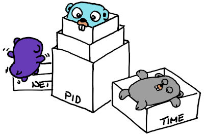

# Linux kernel Namespaces 

[](http://godoc.org/github.com/thediveo/lxkns)
[](docs/architecture.md)
[](https://img.shields.io/github/license/thediveo/lxkns)

[](https://goreportcard.com/report/github.com/thediveo/lxkns)

`lxkns` is a Golang package for discovering Linux kernel namespaces. In every
nook and cranny of your Linux hosts.

In addition, `lxkns` comes with a set of unique CLI namespace discovery tools
and also helps Go programs with switching namespaces.

And all that tested with Go 1.13 and 1.14. And even with support for the new
time namespaces.

## Comprehensive Namespace Discovery

When compared to most well-known and openly available CLI tools, such as
`lsns`, the `lxkns` package detects namespaces even in places of a running
Linux system other tools typically do not consider. In particular:

1. from the procfs filesystem in `/proc/[PID]/ns/*` -- as `lsns` and other
   tools do.
2. bind-mounted namespaces, via `/proc/[PID]/mountinfo`. Our discovery method
   even finds bind-mounted namespaces in _other_ mount namespaces than the
   current one in which the discovery starts.
3. file descriptor-referenced namespaces, via `/proc/[PID]/fd/*`.
4. intermediate hierarchical user and PID namespaces, via `NS_GET_PARENT`
   ([man 2 ioctl_ns](http://man7.org/linux/man-pages/man2/ioctl_ns.2.html)).
5. user namespaces owning non-user namespaces, via `NS_GET_USERNS` ([man 2
   ioctl_ns](http://man7.org/linux/man-pages/man2/ioctl_ns.2.html)).

| tool | `/proc/[PID]/ns/*` ① | bind mounts ② | `/proc/[PID]/fd/*` ③ | hierarchy ④ | owning user namespaces ⑤ |
| -- | -- | -- | -- | -- | -- |
| `lsns` | ✓ | | | |
| `lxkns` | ✓ | ✓ | ✓ | ✓ | ✓ |

Applications can control the extent to which a `lxkns` discovery tries to
ferret out namespaces from the nooks and crannies of Linux hosts.

> Some discovery methods are more expensive than others, especially the
> discovery of bind-mounted namespaces in other mount namespaces. The reason
> lies in the design of the Go runtime which runs multiple threads and Linux
> not allowing multi-threaded processes to switch mount namespaces. In order
> to work around this constraint, `lxkns` must fork and immediately re-execute
> the process it is used in. Applications that want to use such advanced
> discovery methods thus **must** call `reexec.CheckAction()` as early as
> possible in their `main()` function. For this, you need to `import
> "github.com/thediveo/gons/reexec"`.

## gons CLI tools

But `lxkns` is more than "just" a Golang package. It also features CLI tools
build on top of `lxkns` (we _do_ eat our own dog food). To install these tools
into your `$GOPATH/bin` directory, simply run `go install ./...`.

These are the CLI tools:

- `lsuns`
  [](http://godoc.org/github.com/thediveo/lxkns/cmd/lsuns):
  shows _all_ user namespaces in your Linux host, in a neat hierarchy.
  Moreover, it can also show the non-user namespaces "owned" by user
  namespaces. This ownership information is important with respect to
  capabilities and processes switching namespaces using `setns()` ([man 2
  setns](http://man7.org/linux/man-pages/man2/setns.2.html)).

- `lspidns`
  [](http://godoc.org/github.com/thediveo/lxkns/cmd/lspidns):
  shows _all_ PID namespaces in your Linux host, in a neat hierarchy.
  Optionally, the owning user namespaces can be shown interleaved with the PID
  namespace hierarchy.

- `pidtree`
  [](http://godoc.org/github.com/thediveo/lxkns/cmd/pidtree):
  shows either the process hierarchy within the PID namespace hierarchy or a
  single branch only.

- `nscaps`
  [](http://godoc.org/github.com/thediveo/lxkns/cmd/nscaps):
  determines a process' capabilities in a namespace, and then displays the
  owning user namespace hierarchy (or hierarchies) of the process and target
  namespace, together with the current process and namespace capabilities.


### lsuns

In its simplest form, `lsuns` shows the hierarchy of user namespaces.

```
$ sudo lsuns
user:[4026531837] process "kthreadd" (2) created by UID 0 ("root")
└─ user:[4026532277] process "unshare" (15736) created by UID 0 ("root")
```

It gets more interesting with the `-d` (details) flag: `lsuns` then additionally
displays all non-user namespaces owned by the user namespaces. In Linux-kernel
namespace parlance, "owning" refers to the relationship between a newly created
namespace and the user namespace that was active at the time the new namespace
was created. For convenience, `lsuns` sorts the owned namespaces first
alphabetically by type, and second numerically by namespace IDs.

```
$ sudo lsuns -d
user:[4026531837] process "kthreadd" (2) created by UID 0 ("root")
│  ⋄─ cgroup:[4026531835] process "systemd" (1)
│  ⋄─ ipc:[4026531839] process "kthreadd" (2)
│  ⋄─ mnt:[4026531840] process "systemd" (1)
│  ⋄─ mnt:[4026531860] process "kdevtmpfs" (29)
│  ⋄─ mnt:[4026532156] process "systemd-udevd" (161)
│  ⋄─ mnt:[4026532256] process "systemd-timesyn" (298)
│  ⋄─ mnt:[4026532271] process "bluetoothd" (472)
│  ⋄─ mnt:[4026532273] process "unshare" (11697)
│  ⋄─ mnt:[4026532275] process "unshare" (11818)
│  ⋄─ net:[4026531905] process "kthreadd" (2)
│  ⋄─ pid:[4026531836] process "kthreadd" (2)
│  ⋄─ pid:[4026532274] process "bash" (11698)
│  ⋄─ pid:[4026532276] process "bash" (11819)
│  ⋄─ uts:[4026531838] process "systemd" (1)
└─ user:[4026532277] process "unshare" (15736) created by UID 0 ("root")
      ⋄─ mnt:[4026532278] process "unshare" (15736)
      ⋄─ mnt:[4026532280] process "unshare" (15747)
      ⋄─ pid:[4026532279] process "bash" (15737)
      ⋄─ pid:[4026532281] process "bash" (15748)
```

### lspidns

On its surface, `lspidns` might appear to be `lsuns` twin, but for PID namespaces.

```
pid:[4026531836] process "kthreadd" (2)
└─ pid:[4026532274] process "bash" (11698)
   └─ pid:[4026532276] process "bash" (11819)
      └─ pid:[4026532279] process "bash" (15737)
         └─ pid:[4026532281] process "bash" (15748)
```

But hidden beneath the surface lies the `-u` flag; "u" as in user namespace. Now
what have user namespaces to do with PID namespaces? Like other non-user
namespaces, also PID namespaces are owned by user namespaces. `-u` now tells
`lspidns` to show a "synthesized" hierarchy where owning user namespaces and
owned PID namespaces are laid out in a single tree.

```
user:[4026531837] process "kthreadd" (2) created by UID 0 ("root")
└─ pid:[4026531836] process "kthreadd" (2)
   └─ pid:[4026532274] process "bash" (11698)
      └─ pid:[4026532276] process "bash" (11819)
         └─ user:[4026532277] process "unshare" (15736) created by UID 0 ("root")
            └─ pid:[4026532279] process "bash" (15737)
               └─ pid:[4026532281] process "bash" (15748)
```

Please note that this representation is only possible because the capabilities
rules for user and PID namespaces forbid user namespaces criss-crossing PID
namespaces and vice versa.

### pidtree

`pidtree` shows either the process hierarchy within the PID namespace
hierarchy or a single branch only. It additionally shows translated PIDs,
which are valid only inside the PID namespace processes are joined to. Such as
in `"containerd" (24446=78)`, where the PID namespace-local PID is 78, but
inside the initial (root) PID namespace the PID is 24446 instead.

```
$ sudo pidtree
pid:[4026531836], owned by UID 0 ("root")
├─ "systemd" (1974)
│  ├─ "dbus-daemon" (2030)
│  ├─ "kglobalaccel5" (2128)
...
│  ├─ "containerd" (1480)
│  │  ├─ "containerd-shim" (21411)
│  │  │  └─ "foobar" (21434)
│  │  ├─ "containerd-shim" (24173)
│  │  │  └─ pid:[4026533005], owned by UID 0 ("root")
│  │  │     └─ "systemd" (24191/1)
│  │  │        ├─ "systemd-journal" (24366/70)
│  │  │        ├─ "containerd" (24446/78)
```
  
Alternatively, it can show just a single branch down to a PID inside a
specific PID namespace.

```
$ sudo pidtree -n pid:[4026532512] -p 3
pid:[4026531836], owned by UID 0 ("root")
└─ "systemd" (1)
    └─ "kdeinit5" (2098)
      └─ "code" (20384)
          └─ pid:[4026532512], owned by UID 1000 ("harald")
            └─ "code" (20387/1)
                └─ "code" (20389/3)
```

Please see also the [pidtree
command](https://godoc.org/github.com/thediveo/lxkns/cmd/pidtree)
documentation.

### nscaps

`nscaps` calculates a process capabilities in another namespace, based on the
owning user namespace hierarchy. It then displays both the process' and target
namespace user namespace hierarchy for better visual reference how process and
target namespace relate to each other.

Examples like the one below will give unsuspecting security "experts" a series
of fits -- despite this example being perfectly secure.

```
⛛ user:[4026531837] process "systemd" (129419)
├─ process "nscaps" (210373)
│     ⋄─ (no capabilities)
└─ ✓ user:[4026532342] process "unshare" (176744)
   └─ target net:[4026532353] process "unshare" (176744)
         ⋄─ cap_audit_control    cap_audit_read       cap_audit_write      cap_block_suspend
         ⋄─ cap_chown            cap_dac_override     cap_dac_read_search  cap_fowner
         [...]
         ⋄─ cap_syslog           cap_wake_alarm
```

...it's secure, because our superpower process can't do anything outside its
realm. But the horror on the faces of security experts will be priceless.

```
⛔ user:[4026531837] process "systemd" (211474)
├─ ⛛ user:[4026532468] process "unshare" (219837)
│  └─ process "unshare" (219837)
│        ⋄─ cap_audit_control    cap_audit_read       cap_audit_write      cap_block_suspend
│        ⋄─ cap_chown            cap_dac_override     cap_dac_read_search  cap_fowner
│        ⋄─ cap_fsetid           cap_ipc_lock         cap_ipc_owner        cap_kill
│        ⋄─ cap_lease            cap_linux_immutable  cap_mac_admin        cap_mac_override
│        ⋄─ cap_mknod            cap_net_admin        cap_net_bind_service cap_net_broadcast
│        ⋄─ cap_net_raw          cap_setfcap          cap_setgid           cap_setpcap
│        ⋄─ cap_setuid           cap_sys_admin        cap_sys_boot         cap_sys_chroot
│        ⋄─ cap_sys_module       cap_sys_nice         cap_sys_pacct        cap_sys_ptrace
│        ⋄─ cap_sys_rawio        cap_sys_resource     cap_sys_time         cap_sys_tty_config
│        ⋄─ cap_syslog           cap_wake_alarm
└─ target net:[4026531905] process "systemd" (211474)
      ⋄─ (no capabilities)
```

Please see also the [nscaps
command](https://godoc.org/github.com/thediveo/lxkns/cmd/nscaps)
documentation.

## Package Usage

The following example code runs a full namespace discovery using
`Discover(FullDiscovery)` and then prints all namespaces found, sorted by
their type, then by their ID.

```go
package main

import (
    "fmt"
    "github.com/thediveo/gons/reexec"
    "github.com/thediveo/lxkns"
)

func main() {
    reexec.CheckAction() // must be called before a full discovery
    result := lxkns.Discover(lxkns.FullDiscovery)
    for nsidx := lxkns.MountNS; nsidx < lxkns.NamespaceTypesCount; nsidx++ {
        for _, ns := range result.SortedNamespaces(nsidx) {
            fmt.Println(ns.String())
        }
    }
}
```

## Copyright and License

`lxkns` is Copyright 2020 Harald Albrecht, and licensed under the Apache
License, Version 2.0.
