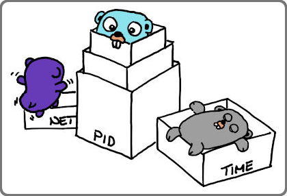

<!-- markdownlint-disable-next-line MD022 -->
# Linux kernel Namespaces

## Overview

`lxkns` discovers Linux namespaces and also the mount points inside mount
namespaces. The discovery engine then relates the found namespaces to
containers, where possible. In (almost) every nook and cranny of your Linux
hosts, for instance by looking at bind-mounts and open file descriptors.

The following container engine workloads are detected:
- Docker,
- plain containerd,
- Podman (but please see the [separate instructions](podman.md)).

The `lxkns` discovery engine can be operated as a stand-alone REST service with
additional web UI. Alternatively, it can be embedded/integrated into other
system diagnosis tools.

For mount namespaces, lxkns finds mount points even in process-less mount
namespaces (for instance, as utilized in ["snap"
technology](https://snapcraft.io/docs)). Our discovery engine even determines
the visibility of mount points, taking different forms of "overmounting" into
consideration.

Take a look at the comprehensive [user (and developer)
manual](https://thediveo.github.io/lxkns).

> Please check [Important Changes](https://thediveo.github.io/lxkns#/changelog),
> especially if you have been used the API in the past, and not only the
> service.

Or, watch the short overview video how to find your way around discovery web
frontend:

## Notes

`lxkns` supports versions of Go that are noted by the [Go release
policy](https://golang.org/doc/devel/release.html#policy), that is, major
versions _N_ and _N_-1 (where _N_ is the current major version).

## Hacking It

This project comes with comprehensive unit tests, also covering leak checks:

* goroutine leak checking courtesy of Gomega's
  [`gleak`](https://onsi.github.io/gomega/#codegleakcode-finding-leaked-goroutines)
  package.

* file descriptor leak checking courtesy of the
  [@thediveo/fdooze](https://github.com/thediveo/fdooze) module.

> **Note:** do **not run parallel tests** for multiple packages. `make test`
ensures to run all package tests always sequentially, but in case you run `go
test` yourself, please don't forget `-p 1` when testing multiple packages in
one, _erm_, go.

## ⚖️ Copyright and License

`lxkns` is Copyright 2020‒22 Harald Albrecht, and licensed under the Apache
License, Version 2.0.
