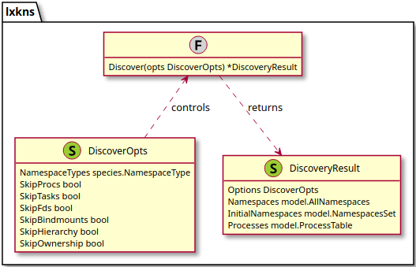
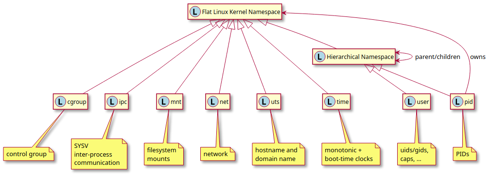

# lxkns Architectural Overview

> Looking for the API
> 
> instead? [lxkns reference docs](http://godoc.org/github.com/TheDiveO/lxkns).

## Package Overview

From an API user's perspective, there are the following "main" relevant
packages:

- `lxkns`: namespace discovery and PID translation.
- `lxkns/model`: defines the core information model of namespaces and
  processes, with their relationships.
- `lxkns/species`: supplies kernel-related namespace type and textual
  representation definitions and convenience functions.
- `lxkns/ops`: offers a Go-ish API to the kernel ioctl() API for discovering
  namespace IDs, types and relationships; additionally offers (limited)
  namespaces switching for individual Go routines (respective their specific
  backing OS thread).

Auxiliary packages:

- `lxkns/cmd`: eating our own dog food, it is home to the  `lsuns`, `lspns`,
  and `pidtree` commands. These namespace CLI tools simultaneously serve as
  more complex real-world examples.
- `lxkns/examples`: examples illustrating the `lxkns` API usage.
- `lxkns/internal/namespaces`: contains the implementation of the various
  namespace-related interfaces from `lxkns/model`.

## Discovering Namespaces

The gory details of discovering Linux-kernel namespaces are hidden beneath the
surface of `Discover()`.

> Rant: _Writing a namespace discoverer in Golang is going down the Gopher hole.
> For instance, Golang has the annoying habit of interfering with switching
> certain namespaces (such as mount namespaces) because it often runs multiple
> OS threads and switches go routines from OS thread to another OS thread
> whenever it feels inclined to do so. Not least are the
> [`gons`](https://github.com/thediveo/gons) and
> [`gons/reexec`](https://github.com/TheDiveO/gons/tree/master/reexec) packages
> testament to the literal loops to go through in order to build a working
> namespace discovery engine in Golang. Now contrast this with a single-threaded
> Python implementation..._

## Linux Namespaces From 10,000m

Simply put, [Linux
namespaces](http://man7.org/linux/man-pages/man7/namespaces.7.html) are a kernel
mechanism to “partition” certain types of kernel resources. Processes within a
“partition” will only see the resources allocated to this “partition”, such as
network interfaces, processes, filesystem mounts, et cetera.

Linux namespaces are somewhat peculiar, as shown in this diagram (please note
that element names depicted are not any valid `lxkns` types):

- Linux kernal namespaces have no names; the term “namespace” originally
  derives from the first Linux namespace type implemented ever, [mount
  namespaces](http://man7.org/linux/man-pages/man7/mount_namespaces.7.html).
  Mount namespaces allow different filesystem namespaces. Thus, the term
  "namespace" originally referred to the file and directory names, this can
  still be spotted from the kernel type constant `CLONE_NEWNS`, which is the
  only one nowadays to not specify its specific type, unlike `CLONE_NEWNET`,
  et cetera.

- most types of namespaces are flat: they don't form hierarchies and also
  don't nest. The exception are “PID” and “user” namespaces, which form
  hierarchies. “user” namespaces are also said to be “nested”.

- “user” namespaces are special in that they “own” not only their child user
  namespaces, but also all other types of namespaces. That is, they control
  the capabilities processes possess in other namespaces than the ones a
  process is currently attached to.

Some important peculiarities to keep in mind, as they influence the
architecture of `lxkns`...

### Namespace Identifiers (Horse ./. Barn Door)

In a twist of irony, Linux kernel namespaces have no names.

Instead they are only uniquely identifyable by their [inode
numbers](https://en.wikipedia.org/wiki/Inode) and device ID. Each namespace
has its own inode number, albeit after deleting one namespace, the next
namespace being created may very well get the _old_ inode number re-assigned
again. (See also [When does Linux garbage-collect
namespaces?](https://unix.stackexchange.com/questions/560912/when-does-linux-garbage-collect-namespaces)
on stackexchange).

While the device ID of any namespace in current kernels always refer to the
same single instance of the `nsfs` kernel namespace filesystem, the world has
been warned of potentially using multiple namespace filesystem instances in
the future (“_I reserve the right for st_dev to be significant when comparing
namespaces._”, https://lore.kernel.org/lkml/87poky5ca9.fsf@xmission.com/).

In a twist of irony the same dire kernel warner then left out the dev ID
information in all places where the Linux kernel presents a textual
representation of a namespace reference. That is, the kernel just exposes
`net:[4026531905]` instead of something like maybe `net:[4,4026531905]`. This
affects all references in `/proc`, including `/proc/mountinfo`. The result:
simply a (reserved) mess.

The core of `lxkns` works with (_dev-ID_, _inode_) namespace identifiers. The
(only?) critical place is where namespace IDs are entering via textual
representations only, because these lack the device ID for fully
qualification. `lxkns` works around this mess as follows:

- the CLI tools always use the kernel's established current format for output
  _and_ input parameters, that is, `net:[4026531905]`. After all, that's what
  all the well-established tools like `lsns` do.
- `lxkns.species` defines two functions through which half-baked inode numbers
  enter the namespace ID universe:
  - `IDwithType(s string) (id NamespaceID, t NamespaceType)` parses a textual
    namespace representation and then returns the full ID and type of
    namespace. It creates a fully qualified namespace ID by looking at the
    process' network namespace and then uses the device ID of it. In case the
    kernel devs survive breaking namespace ID-related code all over the world,
    then our hope is that at least our functional interface stays constant,
    with only updates necessary to the inner workings of `IDwithType()`.
  - `NamespaceIDfromInode(ino uint64) NamespaceID` works in the same vein as
    `IDwithType()`, but taking only the inode number of a namespace, instead
    of a textual representation. However, this convenience function will
    surely break when the kernel devs go out on a limp and break all things
    namespace identifiers.

Now there's an ugly problem with inodes: they're fine for identity, but they're
useless for access or reference. You simply cannot give the Linux kernel the
inode number whenever it needs a namespace reference. You need some filesystem
reference or a file descriptor referencing a namespace. The most well-known
place for namespace references is the `proc` filesystem. Other places are
bind-mounts, which can be in any corner of the virtual filesystem. And the open
file descriptors of processes and threads.

And finally, there are hierarchical namespaces, where we can end up with“hidden”
PID and user namespaces which do not have any filesystem reference, but can only
be found using special Linux kernel namespace `ioctl()` calls. (_Simply spoken,
a child PID namespace needs to be bind-mounted/fd-referenced for its
process-less(!) parent PID namespace to become hidden, but still alive. For user
namespaces it is already sufficient that a child user namespace has a process,
but its parent user namespace has no processes, to become hidden._)

### Mount Namespaces

[Mount namespaces](http://man7.org/linux/man-pages/man7/mount_namespaces.7.html)
separate sets of mount points. Changing mount the mount namespace of a running
process is only possible as long as the process is single-threaded (that is,
[the process doesn't share filesystem-related
attributes](http://man7.org/linux/man-pages/man2/setns.2.html)). As the Golang
runtime usually quickly goes multi-threaded, changing the mount namespace of an
OS thread isn't possible after the Golang runtime has started ([stackoverflow:
“Calling setns from Go returns EINVAL for mnt
namespace”](https://stackoverflow.com/q/25704661)). This can be achieved by
using, for instance, the [`gons` package](https://github.com/thediveo/gons).

### PID Namespaces

[PID namespaces](http://man7.org/linux/man-pages/man7/pid_namespaces.7.html)
separate process identifiers, usually simply abbreviated as PID. PID namespaces
not only control visibility of PIDs, but also their numbering. PIDs in a new PID
namespace start at 1, somewhat resembling a standalone system.

Processes cannot switch their PID namespaces, but instead are stuck in whatever
PID namespace a process was born into. Linux only allows child processes to
start in different PID namespaces than their parents.

PID namespaces are hierarchical and also nested: given sufficient privileges, a
process in a certain PID namespace can “see” process in child PID namespaces of
its PID namespace, and also further down the hierarchy. But a process cannot see
any process in a parent PID namespace, or any sibling PID namespace.

As an important source for discovering Linux kernel namespaces is the `proc`
process filesystem, the `lxkns` discovery engine basically can only find
namespaces used by processes in the engine's PID namespace, as well as child
namespaces and further down the hierarchy. (_Note: the `lxkns` engine might
discover namespaces in other places through other information sources, but might
not be able to access them for gather further details._)

### User Namespaces

[User namespaces](http://man7.org/linux/man-pages/man7/user_namespaces.7.html)
separate user and group IDs, capabilities, and other kernel resources. They are
hierarchical.

User namespaces control the capabilities a process might have in another
namespace. This control bases on the “ownership” of namespaces (of any type) by
a specific user namespace. Additionally, this control furthermore bases on the hierarchy of user namespaces.

For instance, Linux blocks any process from either re-entering its own current
user namespace (as this would give it full capabilities, _not joking_) or a
parent user namespace. A child user namespace can only be entered by a process
if the process' UID is the same as the owner UID of the child user namespace, or
if it has sufficient capabilities in the current user namespace and thus in all
child namespaces thereof.

## Linux Namespace Representation in lxkns

`lxkns.model` represents the namespace concepts we've just learned in form of four
interfaces, each interface grouping related aspects of namespaces. Please note
that not all types of namespaces offer all interfaces. That is, only
hierarchical “PID” and “user” namespaces offer the `Hierarchy` interface, and
only “user”namespaces offer the fourth `Ownership` interface.

- `Namespace`: this interface gives access to the properties common to all
  Linux kernel namespaces, as well as to what we additionally discovered and
  correlated with namespaces. For instance, the identifier of a namespace
  (which actually is an inode number on the special `nsfs` namespace
  filesystem of the Linux kernel). Or the processes most topmost in the
  process tree and associated with a specific namespace.

- `Hierarchy`: gives access to the parent-child relationships of “PID” and
  “user” namespaces respectively.

- `Ownership`: points out the user (UID) the process belonged to which
  originally created a particular namespace. Additionally, links to all
  namespaces owned by a specific “user” namespace. This interface is available
  only on “user” namespaces.

## Linux Namespaces and Processes

While not all namespaces are necessarily always related to processes, many
namespaces typically are. Not least is the `proc` filesystem an important
place to discover namespaces. `lxkns` automatically discovers the tree of
processes, and the links between processes and namespaces.

To reduce interlinking, each `Namespace` only references those topmost
processes in the process tree which are associated to it: the so-called
“leaders” (`Leaders()`). For instance, for a “Docker” container (greetings to
Dan Welsh!) without any “uninvited” guest processes, there is only exactly one
such leader process “inside” the container (often with PID 1 inside the
container's PID namespace).

Uninvited (privileged) processes which have joined by themselved will show up
as additional leaders. As an aid, especially for display purposes, the oldest
process in terms of a process' start time, is returned by `Ealdorman()`.
Looking for the topmost process in the process tree might yield misleading
results, potentially returning visitor processes after a PID wrap-around on
long-running systems. Taking process start times yields more stable and
sensible results, as uninvited container guest processes won't join until
after the container's initial process has been kicked off.

> **Note:** each and any Linux process is **always** associated with exactly
> one namespace of each of the 7 defined namespace types: cgroup, ipc, mnt,
> net, pid, user, and uts. There is no way for a process not to be associated
> with exactly 7 namespaces, one of each type.

## PID Translation Map

Another special feature of `lxkns` is translating a PID from one “PID”
namespace to another “PID” namespace. Tools using `lxkns` can use the mapping
in order to show PIDs as seen from, say, inside a container, instead of
displaying PIDs as seen by the container host itself.

The PID mapping can be read from the [`proc`
filesystem](http://man7.org/linux/man-pages/man5/proc.5.html), but is in a
rather inconvenient format: the PIDs a specific process has in its own “PID”
namespace, as well as in all the parent “PID” namespaces is stored in the
`NSpid:` field inside `/proc/[PID]/status`. Unfortunately, `NSpid:` only tells
us the PIDs, but not the namespaces. We also need the “PID” namespaces
hieararchy in order to understand which PIDs belongs to which “PID” namespaces.

The PID translation map introduces the concept of a PID being only meaningful
in the context of its “PID” namespace as type `NamespacedPID`. Ignoring how to
index, our PID translation map contains for each process its list of
namespaced PIDs (type `NamespacedPIDs`). As described above, this list is
calculated by combining the `NSpid:` information with the discovered “PID”
namespace hierarchy.

Now, in order to translate (lookup) namespaced PIDs, we simply index all
namespaced PIDs to point to their respective process' list of namespaced PIDs.
This design trades a slight performance degration in for an otherwise much
larger memory consumption in case of indexing all <_namespace-from_, _PID-from_,
_namespace-to_> tuples with their corresponding _PID-tos_.

A `Translate()` operation then looks up the specified namespaced PID, getting
the corresponding process' list of namespaced PIDs. It then returns the PID
matching the destination “PID” namespace.
