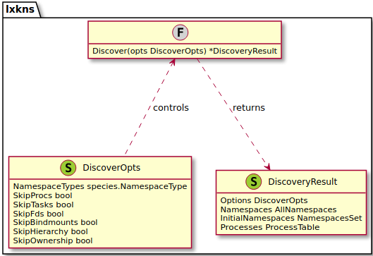
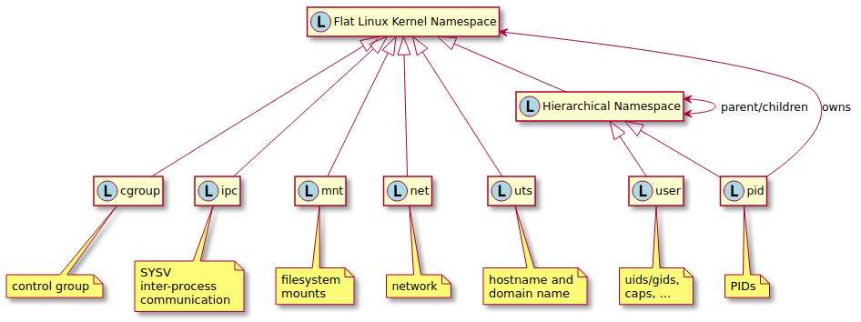
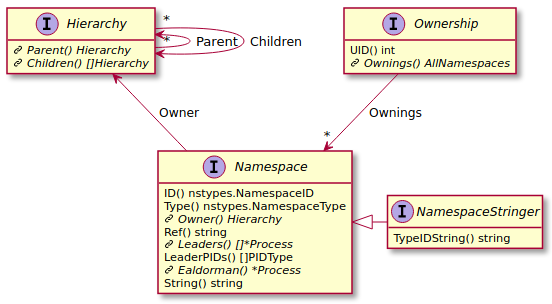
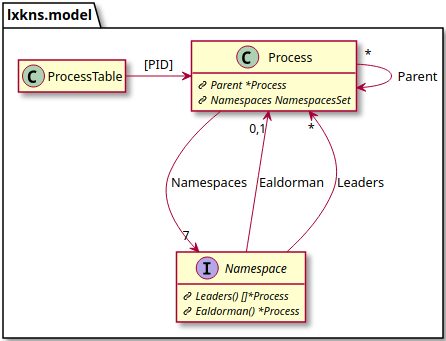
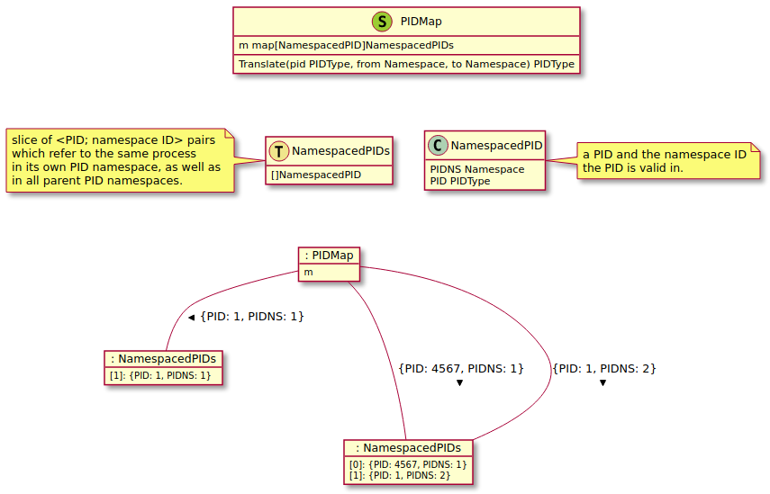

# lxkns Architectural Overview

> Looking for the API
> 
> instead? See [here](http://godoc.org/github.com/TheDiveO/lxkns).

## Package Overview

From an API user's perspective, there are the following three relevant
packages:

- `lxkns`: namespace discovery and PID translation.
- `lxkns/nytypes`: kernel-related namespace type definitions.
- `lxkns/relations`: kernel API for discovering namespace relationships and
  IDs.

Auxiliary packages:

- `cmd`: the `lsuns` and `lspns` commands.
- `examples`: examples illustrating the API usage.

## Discovering Namespaces

The gory details of discovering Linux-kernel namespaces are hidden beneath the
surface of `Discover()`.

> Rant: Writing a namespace discoverer in Golang is going down the Gopher
> hole anyway, as Golang has the annoying habit of interfering with switching
> namespaces due running multiple OS threads and switching go routinges from
> OS thread to OS thread when inclined to do so; not least are the
> [`gons`](https://github.com/thediveo/gons) and
> [`gons/reexec`](https://github.com/TheDiveO/gons/tree/master/reexec)
> packages testament to the literal loops to go through to build a working
> namespace discovery engine in Golang. (Now contrast this with a
> single-threaded Python implementation...)

## Linux Namespaces From 10,000m

Simply put, [Linux
namespaces](http://man7.org/linux/man-pages/man7/namespaces.7.html) (man7
namespaces) are a kernel mechanism to partition certain types of kernel
resources. Processes within a partition will only see the resources allocated
to this partition, such as network interfaces, processes, filesystem mounts,
et cetera.

Linux namespaces are somewhat peculiar, as shown in this diagram (please note
that element names depicted are not any valid `lxkns` types):

- Linux kernal namespaces have no names; the term “namespace” originally
  derives from the first Linux namespace type implemented ever, [mount
  namespaces](http://man7.org/linux/man-pages/man7/mount_namespaces.7.html).
  Mount namespaces allow different filesystem namespaces. Thus, the term
  "namespace" originally referred to the file and directory names, this can
  still be spotted from the kernel type constant `CLONE_NEWNS`, which is the
  only one nowadays to not specify its specific type, unlike `CLONE_NEWNET`,
  et cetera.

- most types of namespaces are flat: they don't form hierarchies and also
  don't nest. The exception are “PID” and “user” namespaces, which form
  hierarchies. “user” namespaces are also said to be “nested”.

- “user” namespaces are special in that they “own” not only their child user
  namespaces, but also all other types of namespaces. That is, they control
  the capabilities processes possess in other namespaces than the ones a
  process is currently attached to.

## Linux Namespace Representation in lxkns

`lxkns` represents the namespace concepts we've just learned in form of four
interfaces, each interface grouping related aspects of namespaces. Please note
that not all types of namespaces offer all interfaces. That is, only
hierarchical “PID” and “user” namespaces offer the `Hierarchy` interface, and
only “user”namespaces offer the fourth `Ownership` interface.

- `Namespace`: this interface gives access to the properties common to all
  Linux kernel namespaces, as well as to what we additionally discovered and
  correlated with namespaces. For instance, the identifier of a namespace
  (which actually is an inode number on the special `nsfs` namespace
  filesystem of the Linux kernel). Or the processes most topmost in the
  process tree and associated with a specific namespace.

- `Hierarchy`: gives access to the parent-child relationships of “PID” and
  “user” namespaces respectively.

- `Ownership`: points out the user (UID) the process belonged to which
  originally created a particular namespace. Additionally, links to all
  namespaces owned by a specific “user” namespace. This interface is available
  only on “user” namespaces.

## Linux Namespaces and Processes

While not all namespaces are necessarily always related to processes, many
namespaces typically are. Not least is the `proc` filesystem an important
place to discover namespaces. `lxkns` automatically discovers the tree of
processes, and the links between processes and namespaces.

To reduce interlinking, each `Namespace` only references those topmost
processes in the process tree which are associated to it: the so-called
“leaders” (`Leaders()`). For instance, for a “Docker” container (greetings to
Dan Welsh!) without any “uninvited” guest processes, there is only exactly one
such leader process “inside” the container (often with PID 1 inside the
container's PID namespace).

Uninvited (privileged) processes which have joined by themselved will show up
as additional leaders. As an aid, especially for display purposes, the oldest
process in terms of a process' start time, is returned by `Ealdorman()`.
Looking for the topmost process in the process tree might yield misleading
results, potentially returning visitor processes after a PID wrap-around on
long-running systems. Taking process start times yields more stable and
sensible results, as uninvited container guest processes won't join until
after the container's initial process has been kicked off.

> **Note:** each and any Linux process is **always** associated with exactly
> one namespace of each of the 7 defined namespace types: cgroup, ipc, mnt,
> net, pid, user, and uts. There is no way for a process not to be associated
> with exactly 7 namespaces, one of each type.

## PID Translation Map

Another special feature of `lxkns` is translating a PID from one “PID”
namespace to another “PID” namespace. Tools using `lxkns` can use the mapping
in order to show PIDs as seen from, say, inside a container, instead of
displaying PIDs as seen by the container host itself.

The PID mapping can be read from the [`proc`
filesystem](http://man7.org/linux/man-pages/man5/proc.5.html), but is in a
rather inconvenient format: the PIDs a specific process has in its own “PID”
namespace, as well as in all the parent “PID” namespaces is stored in the
`NSpid:` field inside `/proc/[PID]/status`. Unfortunately, `NSpid:` only tells
us the PIDs, but not the namespaces. We also need the “PID” namespaces
hieararchy in order to understand which PIDs belongs to which “PID” namespaces.

The PID translation map introduces the concept of a PID being only meaningful
in the context of its “PID” namespace as type `NamespacedPID`. Ignoring how to
index, our PID translation map contains for each process its list of
namespaced PIDs (type `NamespacedPIDs`). As described above, this list is
calculated by combining the `NSpid:` information with the discovered “PID”
namespace hierarchy.

Now, in order to translate (lookup) namespaced PIDs, we simply index all
namespaced PIDs to point to their respective process' list of namespaced PIDs.

A `Translate()` operation then looks up the specified namespaced PID, getting
the corresponding process' list of namespaced PIDs. It then returns the PID
matching the destination “PID” namespace.
