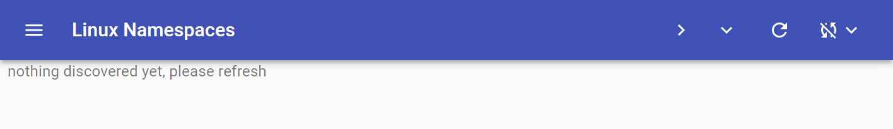

# Getting Around

After [deploying the lxkns service](getting-started), please navigate your web
browser to [http://localhost:5010](http://localhost:5010), where you should be
greeted by the web user interface of the lxkns service.

Initially, the UI will show only a title and a few icon buttons, this is the
so-called "application bar". So let us now look around the UI more closely in
the following sections.
