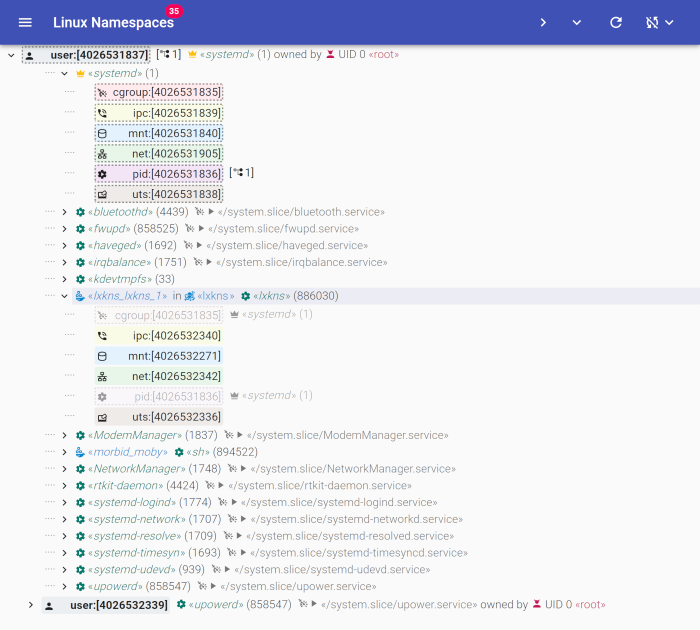

# Getting Started

To quickly start discovering Linux-kernel namespaces and nosing around, we
recommend to deploy the **containerized lxkns service**, because it features a
nice web-based UI.



1. make sure you have installed:
   - Docker and with the [Docker compose v2+
     plugin](https://docs.docker.com/compose/install/linux/)
2. execute
   ```bash
   docker compose -f oci://ghcr.io/thediveo/lxkns/app up -d
   ```
3. navigate your web browser to [http://localhost:5010](http://localhost:5010),
   where you should be greeted by the [lxkns web app](getting-around).

> [!NOTE] `make deploy` builds and starts a Docker composer project. In case you
> want to deploy lxkns using a different container engine, please have a look at
> the composer project `docker-compose.yaml` in `deployments/lxkns/` for the
> required container start parameters (especially with respect to host PID
> namespace, capabilities, and security options).
