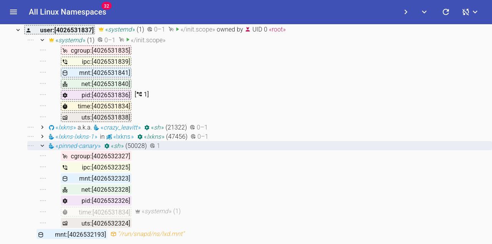

# Getting Started

To quickly start discovering Linux-kernel namespaces and nosing around, we
recommend to deploy the **containerized lxkns service**, because it features a
nice web-based UI.



## Prerequisite

Make sure you have installed Docker and the [Docker compose plugin
v2+](https://docs.docker.com/compose/install/linux/).

## Deploy

Pull and deploy the prebuild multi-architecture image:

```bash
docker compose -f oci://github.com/thediveo/lxkns/app up -d
```

Then navigate your web browser to
[http://localhost:5010](http://localhost:5010), where you should be greeted by
the [lxkns web app](getting-around).
