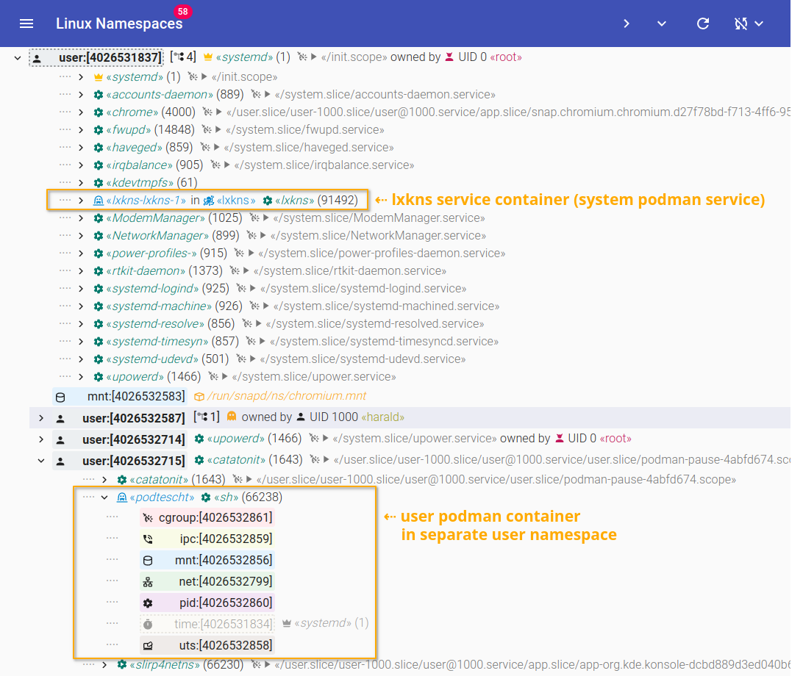
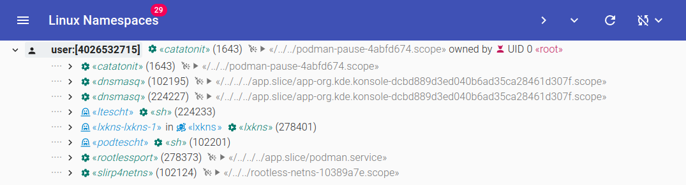

# Podman Workload Awareness

`lxkns` optionally is Podman workload-aware.

Building anything using the Podman sources, even it is just the REST API client,
is ... _awkward_. In consequence, the Podman support in `lxkns` must be opted in
using the `podman` build tag.

Additionally, several C header packages as well as C shared libraries must be
available, even when just the REST API client is needed; sadly, the Podman code
base hasn't still been cleaned up with a separated client module.

- Alpine:
  ```bash
  apk add linux-headers gpgme-dev libassuan-dev libgpg-error-dev
  ```

- Debian/Ubuntu:
  ```bash
  sudo apt-get install \
    btrfs-progs go-md2man iptables libassuan-dev libbtrfs-dev libc6-dev \
    libdevmapper-dev libglib2.0-dev libgpgme-dev libgpg-error-dev \
    libprotobuf-dev libprotobuf-c-dev \
    libseccomp-dev libselinux1-dev \
    libsystemd-dev pkg-config runc uidmap
  ```

## `lxkns` System Service

Deploying `lxkns` as a (Podman) system service gives full view not only on the
container workloads of the system's Podman service (as well as Docker and
containerd), but also on the users rootless container workloads.

As `podman-compose` does not support deploying services with `pid: host`, make
sure that you have Docker with the "compose" plugin installed.

Then deploy with `make systempodman`. This will deploy `lxkns` using the system
Podman ~~daemon~~ service using additional Podman-related CLI arguments.

- `--podman=unix:///proc/1/root/run/podman/podman.sock`: enables discovering
  containers from the system Podman ~~daemon~~ service.

- `--user-podmen=/proc/1/root/run/user`: enables automatic discovery of user
  Podman service endpoints inside `/run/user/$UID/`. This discovery is done only
  once during startup. If user services later get added or removed, then the
  `lxkns` service needs to be restarted in order to pick up any changes.



## `lxkns` User Service

Deploying `lxkns` as a rootless per-user service is also possible and naturally
gives only a limited view into that user's rootless container workload.


